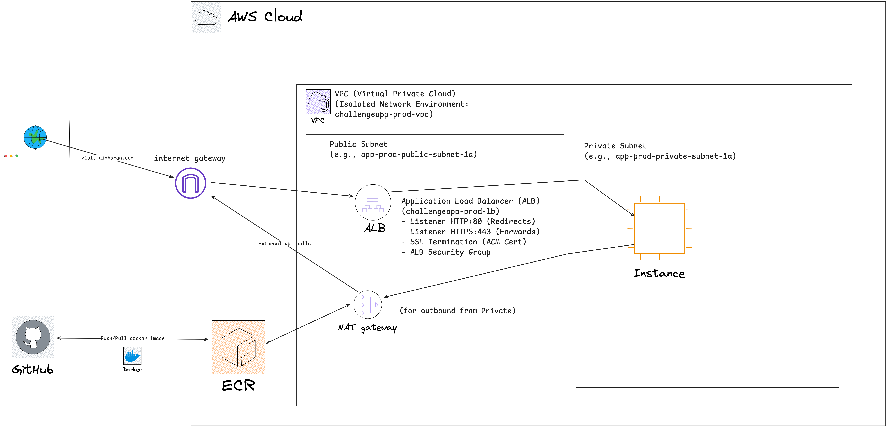

# ChallengeApp AWS Infrastructure Deployment

This repository contains the Terraform code for deploying the `challengeapp` application infrastructure on AWS. It provisions all necessary AWS resources to host a containerized web application, including networking, load balancing, compute, and container registry services.

You can visit a live version of this app here at [ainharan.com](https://www.ainharan.com/)

---

## 1. Project Overview & Purpose

* **What it does:** This is an infrastructure challenge repo, that has been written in a way that should be extensible as the application grows in size/scale
* **Target Environment:** AWS, `ap-southeast-2` (Sydney) region.

---

## 2. Architecture & Design Decisions

**Please read adr folder for individual design decisions.**

HLD


---

## 3. Project Structure

**Explanation:**
* **`.github`**: Contains github actions gitops
* **`adr`**: Contains an architectural decision record
* **`docker`**: Contains all applications
    * **`application-name`**: Contains code for app "application-name"
* **`terraform`**: Contains all terraform infra code
    * **`environments/`**: Contains environment-specific Terraform configurations (e.g., `prod`, `dev`, `staging`). This allows for consistent module usage with different variable values.
    * **`modules/`**: Contains reusable Terraform modules.
    * **`modules/vpc/`**: Encapsulates the entire VPC network stack, including public/private subnets, internet gateway, NAT gateway, and core security groups. This module is designed to be reusable.

---

## 4. Deployment Guide

### Prerequisites

* [Install Terraform](https://www.terraform.io/downloads.html) (v6.0.0 or higher recommended).
* [Configure AWS CLI](https://docs.aws.amazon.com/cli/latest/userguide/cli-chap-configure.html) with appropriate credentials (`AWS_ACCESS_KEY_ID`, `AWS_SECRET_ACCESS_KEY`, `AWS_REGION`). The IAM user/role needs permissions to manage EC2, VPC, ALB, Route 53, ECR, and ACM.
* A verified domain in AWS Route 53 (e.g., `ainharan.com`) and an ACM certificate issued for it in the `ap-southeast-2` region.

### Steps

1.  **Navigate to the environment directory:**
    ```bash
    cd environments/prod
    ```

2.  **Initialize Terraform:**
    ```bash
    terraform init -backend-config=../../backend-configs/prod.hcl
    ```
    This downloads necessary providers and modules.

3.  **Review the plan:**
    ```bash
    terraform plan -var-file=prod.tfvars
    ```
    Carefully review the proposed changes.

4.  **Apply the infrastructure:**
    ```bash
    terraform apply -var-file=prod.tfvars
    ```
    Type `yes` when prompted to confirm the deployment.

5. **Deploy Application Container:** *(NOTE: SHOULD BE PART OF CI/CD BUT did manually because of time constrain)*
    * Ensure your Docker image has been pushed up to the ecr (check the [push-image](.github/workflows/push-image.yml) pipeline).
    * SSH into your EC2 instance:
        ```bash
        ssh -i ~/.ssh/your-key.pem ec2-user@<EC2_PUBLIC_IP>
        ```
    * Pull the Docker image (ensure Docker daemon is running and user is in `docker` group):
        ```bash
        docker pull $(terraform output ecr_repository_url):<IMAGE_TAG>
        ```
        (Replace `<IMAGE_TAG>` with your application's tag, e.g., `9f8df66212fd150a065c01614eda24ea58057762`)
    * Run the Docker container, mapping host port 80 to container port 80:
        ```bash
        docker run -d -p 80:80 $(terraform output ecr_repository_url):<IMAGE_TAG>
        ```

### Destroying Infrastructure

1.  **Navigate to the environment directory:**
    ```bash
    cd environments/prod
    ```
2.  **Destroy resources:**
    ```bash
    terraform destroy -var-file=prod.tfvars
    ```
    Type `yes` when prompted.

---

## 5. Future Enhancements / Considerations

* Consider auto-scaling the EC2 instance based on load.
* Eliminate single points of failure
* Add another private subnet for the 3rd tier (database) in a production system
* Automate Docker deployment to EC2 (e.g., using ECS, AWS CodeDeploy, user data script with Cloud-Init or Ansible).
* Logging: Needs to be enhanced for larger applications, standardized with fluentd/fluentbit and streamed to a sink (which also archives)
* Add monitoring and alerting.
* Implement blue/green or rolling deployments.
* Integrate CI/CD pipeline for automated builds and deployments.
* Add linting and security checks to pipeline

---
